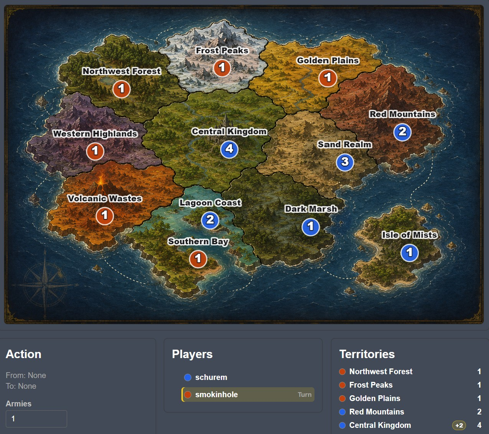
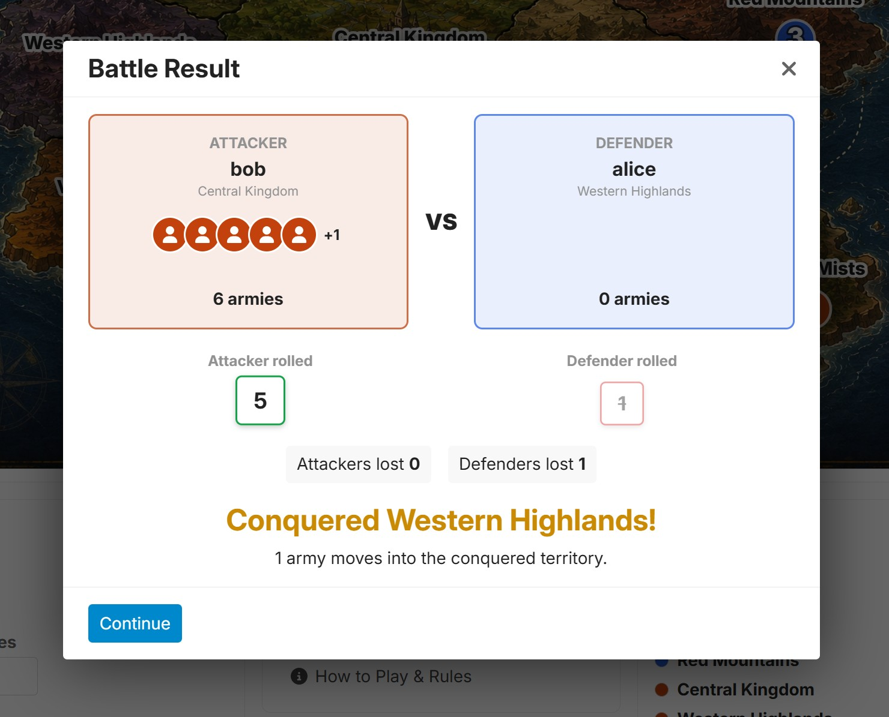

# discourse-not-risk

A small Discourse plugin that adds a forum-native, turn-based, Risk-inspired strategy game using a fictional test campaign map.

This is an MVP. It intentionally does not include cards, objectives, teams, AI players, fog of war, or a polished admin UI.

If people use it or like the idea I might add things, plus of course feel free to fork and add away.

## Screenshot

Main game map



Battles!



## Creating a game

Create a normal Discourse topic first. Then either be logged in as Staff and use the browser console helper below or call the staff-only JSON endpoint with that topic ID:

```bash
curl -X POST http://localhost:3000/not-risk/games.json \
  -H "Content-Type: application/json" \
  -d '{"topic_id":123,"name":"Fantasy 12 Campaign"}'
```
(or use the browser script helper below)

The endpoint creates a game and appends this placeholder to the first post:

```text
[not-risk game=123]
```

The cooked post renders a compact campaign summary. Use **Open War Room** to play at:

```text
/not-risk/games/123
```

## MVP flow

1. Staff creates a new stub topic and then creates the game using the browser script or curl POST.
2. Players join, or staff adds players with `POST /not-risk/games/:id/join`.
3. Staff starts the game.
4. Current player deploys reinforcements based on territories held: `max(3, owned territories / 2 + territory bonuses)`.
5. Current player may attack adjacent enemy territories repeatedly.
6. Current player advances to fortify, then may fortify once between adjacent owned territories.
7. Current player ends the turn.
8. The plugin creates one topic reply summarizing the completed turn.

All committed actions are stored in `not_risk_events`.

Territory bonuses are currently: Central Kingdom +2, Southern Bay +1, and Isle of Mists +1. At game start, one additional non-bonus territory is randomly promoted to +1 for that game. Its starting owner will not be the player who receives Central Kingdom. Starting ownership is randomized, but the three fixed bonus territories are dealt across players first so one player cannot start with all three.

## Map assets

The MVP uses a raster-backed test Fantasy 12 map. The base art is served from:

```text
/plugins/discourse-not-risk/images/fantasy-12-small.jpg
```

Territory labels, army badges, ownership tint, selection state, and hit zones are SVG overlays driven by `lib/not_risk/maps/fantasy_12_risklike.json`. If you have local development games created with an older map key, recreate them after updating the plugin.

The intention is to create a large map with multiple territories into continents for bonuses, plus allowing 4 to 6 players.

## API

```text
GET    /not-risk/games/:id
POST   /not-risk/games
POST   /not-risk/games/:id/join
POST   /not-risk/games/:id/start
POST   /not-risk/games/:id/deploy
POST   /not-risk/games/:id/attack
POST   /not-risk/games/:id/advance_to_fortify
POST   /not-risk/games/:id/fortify
POST   /not-risk/games/:id/end_turn
```

## Tests

Run from the Discourse checkout after linking the plugin:

```bash
bundle exec rspec plugins/discourse-not-risk/spec
```

For a narrower backend pass:

```bash
bundle exec rspec \
  plugins/discourse-not-risk/spec/services/not_risk_game_engine_spec.rb \
  plugins/discourse-not-risk/spec/requests/not_risk_games_controller_spec.rb \
  plugins/discourse-not-risk/spec/lib/not_risk_pretty_text_spec.rb
```

## Staff Browser Helpers (temp until admin UI)

```jscript
const csrf = document.querySelector("meta[name=csrf-token]").content;

async function nr(path, body = {}) {
  const res = await fetch(`/not-risk${path}.json`, {
    method: "POST",
    credentials: "same-origin",
    headers: {
      "Content-Type": "application/json",
      "X-CSRF-Token": csrf,
    },
    body: JSON.stringify(body),
  });

  const text = await res.text();
  const json = JSON.parse(text);
  console.log(json);
  return json;
}
```

```jscript
// Create the game replacing TOPIC_ID with the integer of the one you made.
const game = await nr("/games", {
  topic_id: TOPIC_ID,
  name: "Board Game Test Campaign",
});
```

```jscript
// Join existing forum members to the game
// /u/username.json should give back id e.g. "users" "id"
await nr(`/games/${game.game.id}/join`, { user_id: ALICE_ID });
await nr(`/games/${game.game.id}/join`, { user_id: BOB_ID });
```

## License

This project is licensed under the MIT License. See [LICENSE](LICENSE).
